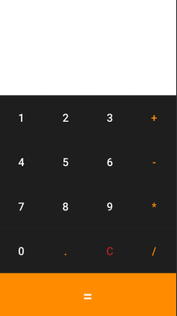
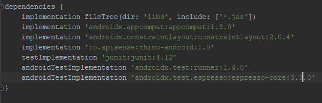

# Application Mobile de calculatrice

 

Ceci est une petite application qui permet d'appréhender le concepts d'évènement en Java coté mobile

## TECHNOLOGIES UTILISEES
* Core Java
* SDK version 30
* Rhyno (c'est un moteur de script qui nous as permi d'efectuer toutes les opérations mathématiques)

## Dependances

 

